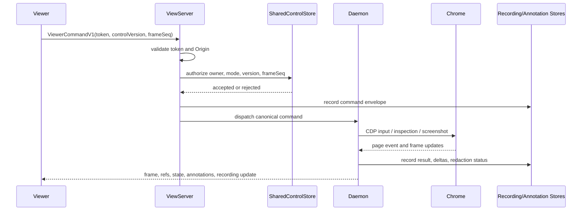

# Interactive Browser Workbench Design

## Goal

`gsd-browser view` is a secure bidirectional browser workbench for coding agents. It streams the real Chrome session, accepts authenticated human input from the viewer, lets the human mark UI intent through annotations, and records bounded reproduction flows as evidence bundles.

The workbench gives the agent eyes, hands, DevTools context, and proof while preserving human takeover, privacy boundaries, and deterministic control rules.

## Product Shape

The viewer feels like a browser surface. The human can click, type, scroll, drag, and use keyboard input against the streamed page. The page itself stays inside the controlled Chrome session. The viewer never iframes, proxies, loads, or executes target-origin content.

The viewer has four visible modes:

- `Control`: human input forwards to the active Chrome page through the daemon.
- `Annotate`: human input creates notes and regions. Page input forwarding is disabled.
- `Record`: the session writes a bounded evidence artifact for a reproduced flow.
- `Sensitive`: the human controls the page while capture, logs, annotations, and recording evidence are redacted or paused.

The agent and human share one browser session. Control ownership, pause, step, approval, and privacy are explicit state, not implicit viewer behavior.

## Non-Goals

- The viewer does not embed the target website through an iframe.
- The viewer does not proxy target network requests.
- The MVP does not resolve source files, React components, Svelte components, or framework ownership.
- The MVP does not record continuous video by default.
- The MVP does not read the OS clipboard implicitly.
- The MVP does not capture file picker, system permission dialog, or native browser UI interactions as page input.

## Validated Spike Evidence

Five spikes establish the core contracts:

- `001-viewer-input-fidelity`: viewer input maps with `(client - viewerRect - letterboxOffset) / renderedScale`. DPR affects bitmap transport, not target DOM `clientX/clientY`. Scrolled pages preserve viewport-relative client coordinates while page coordinates include scroll.
- `002-viewer-security-token`: loopback endpoints require an unguessable per-view token bound to session, viewer, origin, and expiry. State-changing endpoints require matching `Origin`.
- `003-shared-control-state-machine`: `controlVersion` and `frameSeq` checks run before ownership checks. Takeover invalidates stale input, pause blocks agent input, step grants exactly one agent action, and sensitive mode blocks agent actions.
- `004-annotation-mode-prototype`: annotate mode captures click and drag gestures without forwarding page actions. Structured annotations include boxes, notes, page context, target metadata, partial reasons, and redaction markers.
- `005-flow-recording-artifact`: flow recording uses a versioned bundle with manifest, ordered events, frame artifacts, annotations, logs, deltas, hashes, start/stop boundaries, excluded boundary hashes, and redaction metadata.

## Architecture

### Core Boundary

All browser effects go through the daemon.

The viewer sends typed `ViewerCommandV1` messages. The daemon authenticates the viewer, validates control state, records the command, maps it into the canonical input/event model, dispatches CDP input or annotation capture, and emits resulting state back to viewer clients.

The viewer never calls CDP directly.

### Components

- `ViewServer`: local HTTP and WebSocket server for viewer HTML, frame stream, refs, control state, annotations, recording state, and input commands.
- `ViewerAuth`: per-view token issuing and validation.
- `SharedControlStore`: owner, mode, version, frame sequence, approval, sensitive privacy state.
- `UserInputDispatcher`: canonical input event validator and CDP dispatcher.
- `PageStateTracker`: URL, title, loading state, origin, target/page/frame ids, frame sequence.
- `AnnotationStore`: in-memory and artifact-backed annotation records.
- `RecordingStore`: active recording segment and completed artifact bundle writer.
- `PrivacyGuard`: central suppression/redaction policy for capture, logs, timeline, annotations, and artifacts.

### Data Flow



## Viewer Authentication

Every viewer URL includes a short-lived token:

```text
http://127.0.0.1:<port>/?session=<sessionId>&viewer=<viewerId>&token=<token>
```

The token is HMAC-signed and binds:

- `aud = "gsd-browser-viewer"`
- `sessionId`
- `viewerId`
- `origin`
- `issuedAtMs`
- `expiresAtMs`
- `capabilities`

Viewer HTML, WebSocket upgrades, `/control`, `/input`, `/annotation`, `/recording`, and log export endpoints require the token. State-changing HTTP endpoints also require a matching `Origin` header. WebSocket upgrades validate token, `Origin`, session, viewer id, expiry, required capability, and loopback host before accepting the connection.

Capability mapping:

- `view`: viewer HTML and local frame stream
- `state`: page/control/recording state reads
- `input`: page input
- `control`: pause, resume, step, takeover, release
- `annotation`: annotation create/list/get/resolve/clear
- `recording`: record start/pause/resume/stop/list/get/discard
- `export`: bundle, log, and annotation export
- `sensitive`: sensitive mode entry and exit

Viewer HTML responses include `Referrer-Policy: no-referrer`, `Cache-Control: no-store`, and CSP `default-src 'self'; connect-src 'self'; img-src 'self' data: blob:; frame-ancestors 'none'; base-uri 'none'`. The viewer reads the token into memory and removes the token from the address bar with `history.replaceState`.

Rejected requests produce forensic events with reason codes:

- `missing_token`
- `malformed_token`
- `bad_signature`
- `wrong_session`
- `wrong_viewer`
- `wrong_origin`
- `expired_token`
- `non_loopback_host`
- `capability_denied`

The token rotates when a sensitive takeover starts.

## Shared Control State

Shared control is a versioned lease.

```json
{
  "owner": "agent",
  "mode": "agent-running",
  "controlVersion": 7,
  "frameSeq": 104,
  "requestedBy": null,
  "expiresAtMs": null,
  "sensitive": false,
  "reason": ""
}
```

### Owners

- `agent`: agent commands own page input.
- `user`: viewer commands own page input.
- `system`: internal timeout, cancellation, and privacy transitions.

### Modes

- `agent-running`
- `user-takeover`
- `paused`
- `step`
- `approval-required`
- `annotating`
- `sensitive`
- `aborted`

Recording state is an overlay field in viewer/page state, not a control mode. The viewer may record while `agent-running`, `user-takeover`, or `annotating`.

### Validation Order

Every input or page-effect command is validated in this order:

1. Command shape.
2. Token and viewer identity.
3. `controlVersion`.
4. `frameSeq`.
5. takeover preemption.
6. owner claim.
7. privacy gate.
8. mode-specific authorization.
9. risk approval gate.

This order gives deterministic rejection reasons. A stale command rejects as `stale_control_version` before owner checks. A command for an old frame rejects as `stale_frame_seq`.

### Mode Rules

- `agent-running`: agent page input is accepted; user page input is rejected unless it requests takeover.
- `user-takeover`: user page input is accepted; agent page input is rejected except observe/status/export commands.
- `paused`: agent page input is rejected; observe/status/export commands are accepted.
- `step`: one agent page-effect command is accepted, then mode returns to `paused`.
- `approval-required`: the requested action is blocked until approve, deny, or timeout.
- `annotating`: annotation gestures are accepted; page input is rejected.
- `sensitive`: user input is accepted; agent page input, page capture, annotation crops, and recording capture are blocked or redacted.
- `aborted`: pending gated action is cancelled; observe/status/export commands are accepted.

## Interactive Viewer Input

### Coordinate Contract

The viewer maps pointer events into viewport CSS pixels:

```text
viewportX = (clientX - viewerRect.left - letterboxX) / renderedScale
viewportY = (clientY - viewerRect.top - letterboxY) / renderedScale
```

The daemon dispatches viewport CSS coordinates through CDP. DPR affects image transport and capture metadata, not DOM `clientX/clientY`.

Each frame message carries:

```json
{
  "frameSeq": 104,
  "contentType": "image/jpeg",
  "dataBase64": "...",
  "viewportCssWidth": 1440,
  "viewportCssHeight": 900,
  "capturePixelWidth": 2880,
  "capturePixelHeight": 1800,
  "devicePixelRatio": 2,
  "captureScaleX": 2,
  "captureScaleY": 2,
  "url": "http://localhost:3000/settings",
  "title": "Settings"
}
```

The viewer computes letterbox offsets from rendered frame size. A capture-size mismatch creates a warning event and does not override authoritative viewport CSS metadata.

### Input Union

The canonical input type is `UserInputEventV1`. Cloud input and viewer input use the same canonical model.

```json
{
  "schema": "UserInputEventV1",
  "inputId": "inp_01J...",
  "source": "viewer",
  "owner": "user",
  "controlVersion": 7,
  "frameSeq": 104,
  "pageId": 1,
  "targetId": "target-...",
  "frameId": "main",
  "coordinateSpace": "viewport_css",
  "kind": "pointer",
  "phase": "click",
  "x": 612,
  "y": 420,
  "button": "left",
  "modifiers": []
}
```

Supported MVP kinds:

- `pointer`: `move`, `down`, `up`, `click`, `double_click`, `context_click`
- `wheel`
- `key`: `down`, `up`, `press`
- `text`
- `navigation`

Supported follow-up kinds:

- `drag`
- `clipboard_set`
- `clipboard_paste`
- `composition`

Clipboard input requires explicit text supplied by the viewer. The daemon never reads the OS clipboard implicitly.

Unsupported flows return explicit errors:

- file picker
- OS permission dialogs
- native browser UI
- external app handoff

## Risk Gate

The daemon evaluates high-impact actions before dispatch through one shared page-effect authorization path. Viewer WebSocket, HTTP `/input`, cloud input, CLI page actions, navigation, file/download commands, recording/export actions, and annotation export use the same control, privacy, and risk gates. Risk detection uses URL/origin, element role/name/text, input kind, visible labels, form context, and destination.

Risk categories:

- purchase/payment
- delete/destructive
- send/invite/share
- OAuth grant
- credential or token entry
- file upload/download
- production/admin origin
- cross-origin navigation
- sensitive form fields

Risky actions enter `approval-required` with:

```json
{
  "requestId": "apr_01J...",
  "actionSummary": "Click button \"Delete project\"",
  "url": "https://app.example.com/projects/acme",
  "origin": "https://app.example.com",
  "element": {
    "role": "button",
    "name": "Delete project"
  },
  "screenshotCropRef": "artifact://pending/apr_01J/crop.png",
  "expiresAtMs": 1777750400000
}
```

Timeout defaults to deny. Approval and denial are recorded as control events.

Approval stores the exact pending command hash. Approval dispatches only that pending command. Pointer risk uses target metadata resolved from current refs, accessibility, or DOM at the viewport coordinate; URL/navigation/text risk runs even when target metadata is unavailable.

## Privacy Mode

Sensitive privacy mode is a hard capture boundary.

On entry:

- agent page input is blocked
- live frame broadcast sends a redacted frame card to non-local consumers
- `cloud_frame` returns a redacted frame card
- screenshot capture is blocked
- ref polling stops
- DOM, accessibility, and annotation context capture stop
- console, network, and dialog logs are partitioned or redacted
- timeline params omit typed text and sensitive selectors
- recording writes a redacted interval event
- debug bundle omits sensitive captures and marks redaction status

The local viewer remains usable by the human controller. Sensitive mode has a persistent visible indicator. Exiting sensitive mode starts a new privacy epoch.

Redaction rules apply to:

- input values
- textareas
- contenteditable regions
- selected text in editable regions
- password fields
- autocomplete fields containing `cc`, `password`, `otp`, `token`, or `webauthn`
- names, ids, labels, and aria labels containing `password`, `token`, `secret`, `apiKey`, `card`, `cvc`, or `ssn`
- URL query parameters with token-like names
- bearer tokens
- high-entropy identifiers
- email addresses in exported evidence
- `data-token` and equivalent token-bearing attributes

Redacted values are represented as:

```json
{
  "present": true,
  "redacted": true,
  "classification": "credential",
  "originalHash": "sha256:..."
}
```

## Annotation Layer

### Viewer Behavior

The viewer has explicit `Control` and `Annotate` controls. In `Annotate`, a capture layer sits above the streamed frame. Pointer events never forward to CDP. `Escape` cancels an in-progress annotation.

Annotation gestures:

- click element or point
- drag region
- add note
- save
- resolve
- clear
- export

The viewer displays saved annotations as overlays and includes status: `open`, `resolved`, `stale`, `ambiguous`, or `missing`.

### Annotation Schema

```json
{
  "schema": "AnnotationV1",
  "annotationId": "ann_01J...",
  "sessionId": "sess_...",
  "viewerId": "view_...",
  "pageId": 1,
  "targetId": "target-...",
  "frameId": "main",
  "frameSeq": 104,
  "kind": "element",
  "status": "open",
  "note": "Make this the primary action",
  "url": "http://localhost:3000/settings",
  "title": "Settings",
  "origin": "http://localhost:3000",
  "createdBy": "user",
  "createdAtMs": 1777750000000,
  "viewport": {
    "width": 1440,
    "height": 900,
    "devicePixelRatio": 2,
    "scrollX": 0,
    "scrollY": 320
  },
  "selection": {
    "coordinateSpace": "viewport_css",
    "box": { "x": 612, "y": 420, "w": 160, "h": 40 },
    "cropHash": "sha256:..."
  },
  "target": {
    "role": "button",
    "name": "Save changes",
    "text": "Save changes",
    "tag": "button",
    "selectorCandidates": [
      { "selector": "button[data-testid=\"save-settings\"]", "confidence": 0.97 },
      { "selector": "button:nth-of-type(2)", "confidence": 0.32 }
    ],
    "domAncestry": [],
    "computedStyles": {
      "display": "inline-flex",
      "fontSize": "14px",
      "backgroundColor": "rgb(255, 255, 255)",
      "color": "rgb(17, 24, 39)"
    },
    "a11y": {
      "role": "button",
      "name": "Save changes",
      "disabled": false
    }
  },
  "artifactRefs": {
    "crop": "annotations/ann_01J/crop.png",
    "fullFrame": "annotations/ann_01J/frame.jpg"
  },
  "partialReasons": [],
  "redactions": []
}
```

For region annotations, `target` may be null and `partialReasons` records `no_element_target`.

Cross-origin inaccessible frame fields are represented with `partialReasons`, not silent omission.

### Resolution

The daemon resolves annotations through selector candidates, role/name/text, DOM ancestry, frame id, URL/origin, and geometry.

Resolution statuses:

- `resolved`: one high-confidence target
- `ambiguous`: multiple plausible targets
- `stale`: page or frame sequence indicates likely outdated context
- `missing`: no plausible target
- `partial`: target context is incomplete due to frame, origin, or redaction limits

## Flow Recording

Flow recording creates bounded reproduction evidence. It is off by default.

Viewer controls:

- `Record`
- `Pause`
- `Resume`
- `Stop`
- `Discard`
- `Export`

A persistent HUD shows recording state, origin scope, elapsed time, captured data classes, privacy state, and redaction counts.

### Recording Commands

```bash
gsd-browser record-start --name checkout-bug
gsd-browser record-stop
gsd-browser recordings
gsd-browser recording-get <id>
gsd-browser recording-export <id> --output bundle.zip
```

### Bundle Layout

```text
recordings/<recordingId>/
  manifest.json
  events.jsonl
  frames/
  snapshots/
  annotations/
  logs/
    console.jsonl
    network.jsonl
    dialog.jsonl
  deltas.json
```

### Manifest

```json
{
  "schema": "BrowserArtifactBundleV1",
  "recordingId": "rec_01J...",
  "sessionId": "sess_...",
  "name": "checkout-bug",
  "startedAtMs": 1777750000000,
  "stoppedAtMs": 1777750042000,
  "startSeq": 1,
  "stopSeq": 19,
  "eventCount": 19,
  "frameCount": 7,
  "annotationCount": 2,
  "consoleErrorCount": 1,
  "failedRequestCount": 1,
  "originScopes": ["http://localhost:3000"],
  "excludedBoundaryEvents": [
    { "position": "pre_start", "hash": "sha256:..." },
    { "position": "post_stop", "hash": "sha256:..." }
  ],
  "redaction": {
    "policy": "default-sensitive",
    "hitCount": 10,
    "classes": ["email", "query_token", "bearer_token", "data_token"]
  },
  "artifacts": {
    "events": "events.jsonl",
    "frames": "frames/",
    "annotations": "annotations/",
    "console": "logs/console.jsonl",
    "network": "logs/network.jsonl",
    "dialog": "logs/dialog.jsonl",
    "deltas": "deltas.json"
  },
  "hashes": {}
}
```

### Event Envelope

Every event has monotonic sequence and explicit source:

```json
{
  "seq": 7,
  "timestampMs": 1777750012000,
  "schema": "BrowserEventV1",
  "recordingId": "rec_01J...",
  "source": "viewer",
  "owner": "user",
  "controlVersion": 9,
  "frameSeq": 112,
  "kind": "input.pointer",
  "url": "http://localhost:3000/checkout",
  "title": "Checkout",
  "origin": "http://localhost:3000",
  "before": {},
  "after": {},
  "redaction": {
    "status": "none"
  },
  "artifactRefs": {}
}
```

Recording start and stop events are inside the artifact. Events outside the boundary are represented only by hashes in `manifest.json`.

### Capture Policy

Recording captures:

- baseline URL/title/session summary
- viewport and DPR
- start screenshot and ref snapshot
- user input events
- agent page-effect events
- navigation and title changes
- console errors
- failed requests
- dialogs
- annotations
- DOM/ref snapshots at state boundaries
- final screenshot and summary

Screenshots and DOM/ref snapshots are captured after navigation, before and after committed input batches, on console error, on failed request, on dialog, on annotation, and at stop.

Sensitive mode writes a redacted interval event and omits capture payloads.

Default recording privacy policy excludes cookies, localStorage, sessionStorage, request bodies, response bodies, authorization headers, set-cookie headers, and raw request/response payloads. Full URLs are written with sensitive query parameters redacted. Screenshots, DOM snapshots, annotation crops, and full-frame annotation artifacts are omitted during sensitive mode.

## CLI and API Surface

### Viewer

```bash
gsd-browser view
gsd-browser view --print-only
gsd-browser view --interactive
gsd-browser view --history
```

Interactive mode is enabled by default for local viewers with a valid token. `--history` remains read-focused.

### Control

```bash
gsd-browser control-state
gsd-browser takeover
gsd-browser release-control
gsd-browser pause
gsd-browser step
gsd-browser resume
gsd-browser abort
gsd-browser sensitive-on
gsd-browser sensitive-off
```

### Annotation

```bash
gsd-browser annotations
gsd-browser annotation-get <id>
gsd-browser annotation-clear <id>
gsd-browser annotation-clear --all
gsd-browser annotation-resolve <id>
gsd-browser annotation-export --output annotations.json
gsd-browser annotation-request "Select the button to restyle"
```

`annotation-request` creates a pending request, broadcasts it to connected viewers, blocks until an annotation is submitted or timeout expires, and returns annotation JSON. If no viewer is connected, it exits non-zero with `viewer_not_connected`.

### Recording

```bash
gsd-browser record-start --name <name>
gsd-browser record-stop
gsd-browser record-pause
gsd-browser record-resume
gsd-browser recordings
gsd-browser recording-get <id>
gsd-browser recording-export <id> --output <path>
gsd-browser recording-discard <id>
gsd-browser recording-validate <id|path> --json
```

## Page State Tracking

The daemon emits `PageStateV1` whenever URL, title, loading state, active page, active frame, or origin changes.

```json
{
  "schema": "PageStateV1",
  "pageId": 1,
  "targetId": "target-...",
  "frameId": "main",
  "frameSeq": 113,
  "url": "http://localhost:3000/settings",
  "title": "Settings",
  "origin": "http://localhost:3000",
  "loading": false,
  "canGoBack": true,
  "canGoForward": false
}
```

On origin change, agent page input pauses and the viewer shows an origin transition. Recording enters a new origin segment and requests approval to continue for sensitive or untrusted origins.

## Artifact Storage

Bundles are written under the artifact root in `0700` directories.

Storage policy:

- local-only by default
- explicit export required for sharing
- sensitivity manifest in each bundle
- TTL cleanup support
- query params, headers, bearer tokens, emails, and token-bearing attributes redacted by default
- cookies, localStorage, sessionStorage, and request bodies excluded unless explicitly enabled

## Error Handling

All command rejections return structured reasons:

- `viewer_not_authenticated`
- `wrong_origin`
- `expired_viewer_token`
- `stale_control_version`
- `stale_frame_seq`
- `non_owner_input`
- `agent_not_allowed_while_paused`
- `approval_required`
- `approval_denied`
- `approval_timeout`
- `sensitive_privacy_mode`
- `annotation_mode_blocks_page_input`
- `unsupported_native_flow`
- `risk_gate_required`

Errors are viewer-visible and recorded in the timeline or recording event stream when a recording is active.

## Verification

### Unit and Contract Tests

- token validation: missing, malformed, wrong signature, wrong origin, wrong session, expired
- WebSocket upgrade authentication and origin validation
- viewer-to-viewport coordinate mapping across DPR 1/2, letterbox, resize, scroll, capture mismatch
- shared control validation order and rejection reasons
- step as one-action grant
- approval approve, deny, and timeout
- sensitive mode capture suppression matrix
- annotation schema, redaction, partial reasons, and stale resolution
- recording bundle schema, hashes, boundaries, redactions, and analyzer failure cases

### Browser Verification

Use Browser Use for the final local UX pass:

- open `gsd-browser view`
- click target button through the viewer
- type into input through the viewer
- wheel scroll through the viewer
- drag pointer through the viewer
- switch to Annotate and create click/region annotations
- verify no annotate gestures forward to page
- start and stop recording
- inspect generated bundle
- enter sensitive mode and verify redacted frame/log behavior
- repeat desktop and mobile viewport sizes

When Browser Use is unavailable, record the missing Browser Use gate as a verification blocker and run `gsd-browser` plus the local spike harnesses and state assertions as diagnostic evidence.

### Standard Repo Verification

```bash
cargo test --workspace
cargo build --workspace
```

For viewer behavior changes, run a smoke command sequence:

```bash
cargo run -p gsd-browser -- daemon health
cargo run -p gsd-browser -- navigate http://127.0.0.1:<fixture>
cargo run -p gsd-browser -- view --print-only
cargo run -p gsd-browser -- snapshot
```

## Implementation Phases

### Phase 1: Secure Viewer Transport

- Generate per-view tokens.
- Add token validation to viewer HTML, HTTP endpoints, and WebSocket upgrades.
- Add origin validation to state-changing endpoints.
- Add viewer identity to session manifest and viewer state.
- Add rejection events and tests.

### Phase 2: Shared Control Core

- Add `SharedControlState`.
- Route pause, step, abort, takeover, approval, and sensitive controls through the state machine.
- Require `controlVersion` and `frameSeq` on viewer-originated page input.
- Gate agent page-effect commands and viewer input through one authorization path.

### Phase 3: Interactive Viewer Input

- Add `ViewerCommandV1`.
- Add canonical `UserInputEventV1`.
- Route viewer WebSocket input through daemon-owned dispatcher.
- Implement pointer, wheel, key, text, and navigation.
- Add frame metadata and coordinate mapping tests.

### Phase 4: Page State Stream

- Emit URL/title/origin/loading/page/frame changes.
- Update frame sequence on page-affecting input and navigation.
- Pause agent input on cross-origin transitions requiring approval.

### Phase 5: Annotation Layer

- Add annotate mode UI.
- Add `AnnotationStore`.
- Add annotation create/list/get/resolve/clear/export commands.
- Capture viewport box, note, page state, target metadata, partial reasons, redactions, and crop artifacts.
- Include annotations in debug bundles.

### Phase 6: Flow Recording

- Add `RecordingStore`.
- Add record start/pause/resume/stop/list/get/export/discard commands.
- Write `BrowserArtifactBundleV1`.
- Capture ordered events, frames, snapshots, annotations, logs, deltas, hashes, boundaries, and redactions.
- Add analyzer and bundle validation.

### Phase 7: Product Polish

- Add viewer HUD for control owner, mode, recording, origin, privacy, and risk approvals.
- Add back/forward/reload controls.
- Add unsupported native flow messaging.
- Add TTL cleanup and export affordances.

## Open Follow-Up Spike

A real CDP dispatch comparison spike should run before final implementation of Phase 3. It should drive a live Chrome page through the same canonical `UserInputEventV1` model and compare DOM events against the deterministic coordinate harness.

This follow-up is not required for the design direction. It reduces risk for the exact CDP event emission details.
